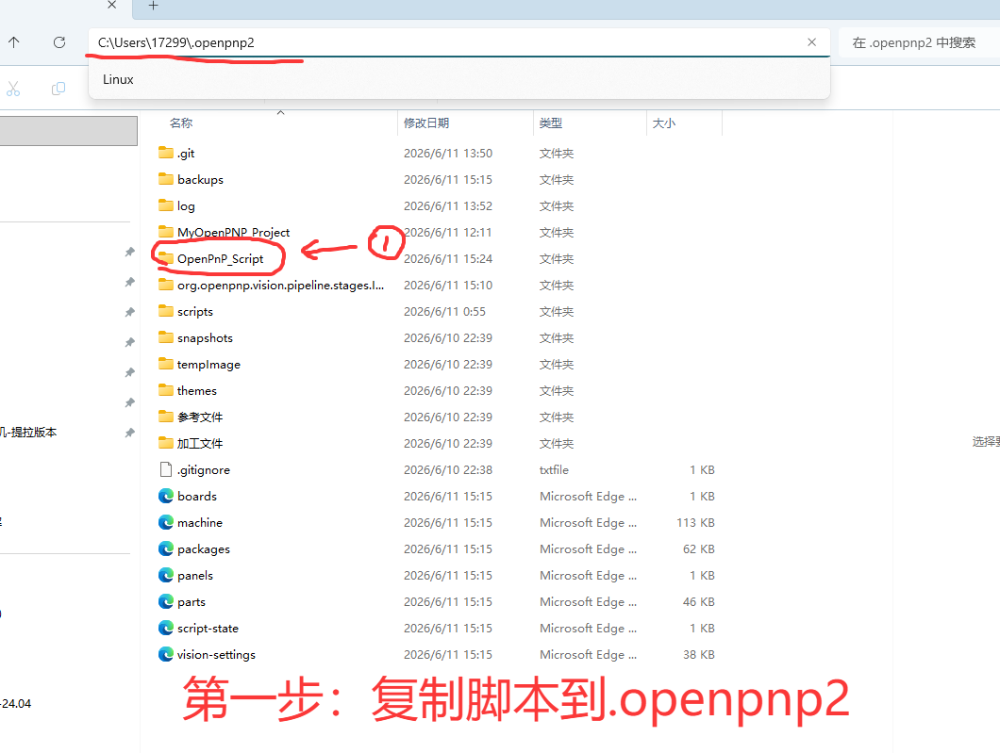
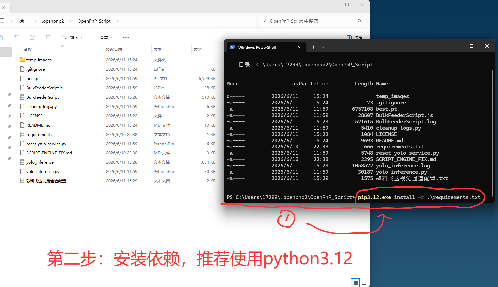
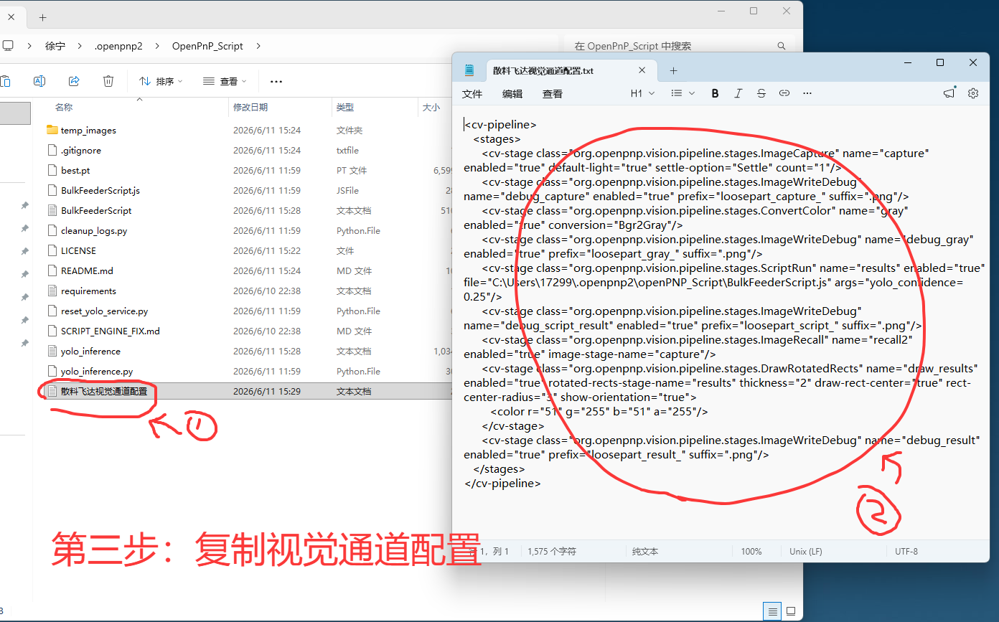
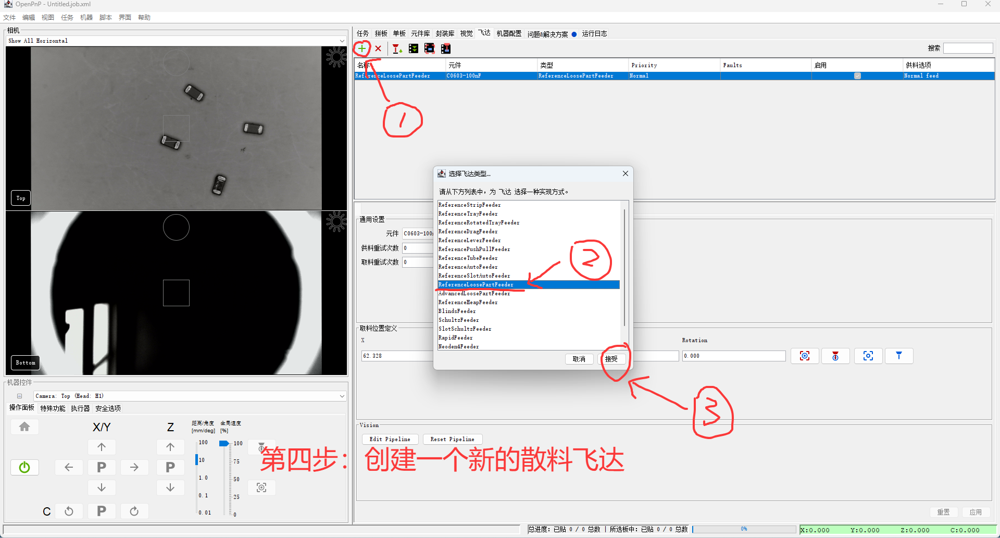
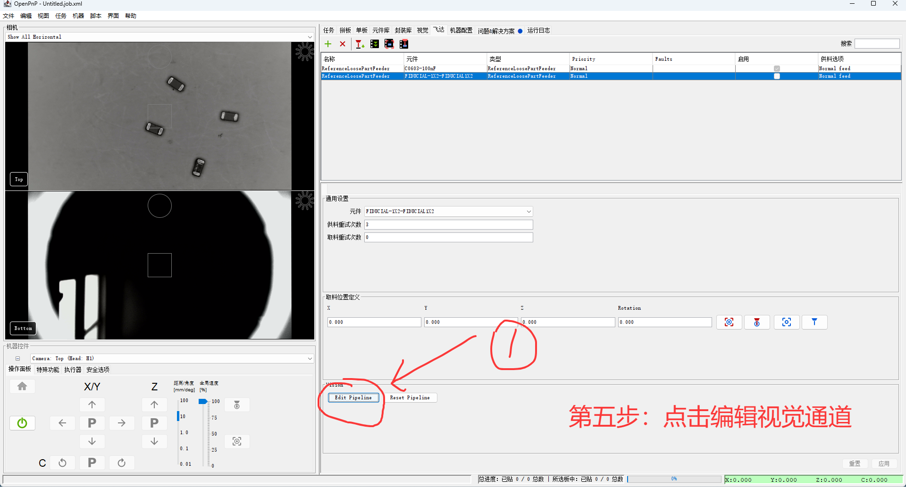
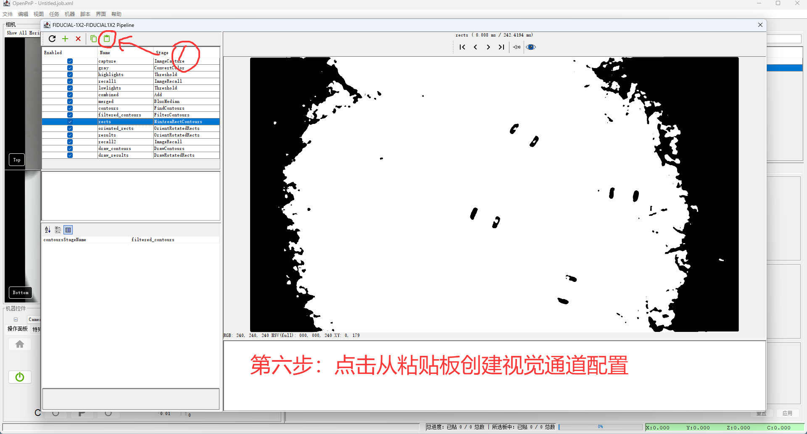
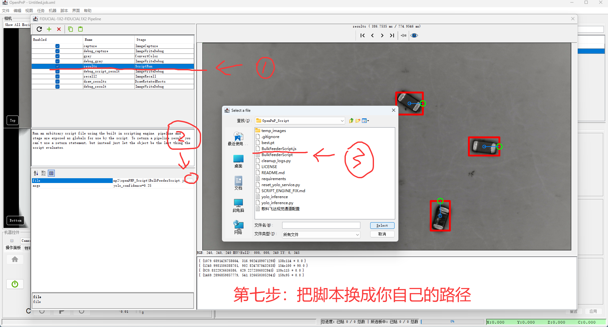
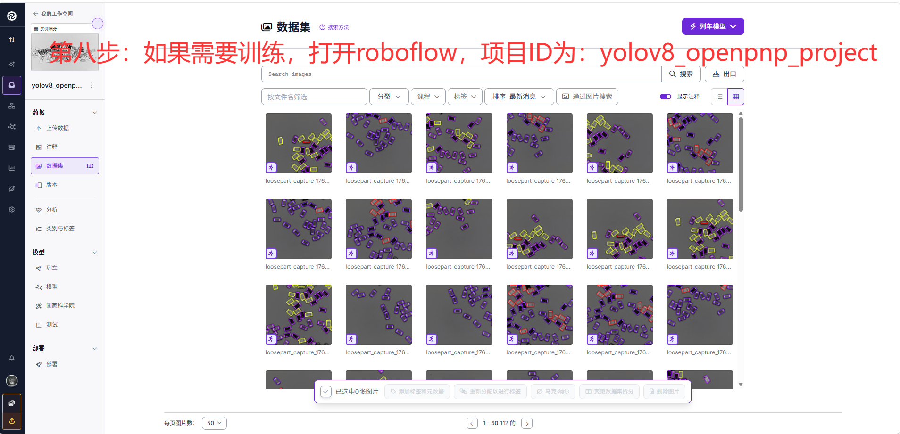
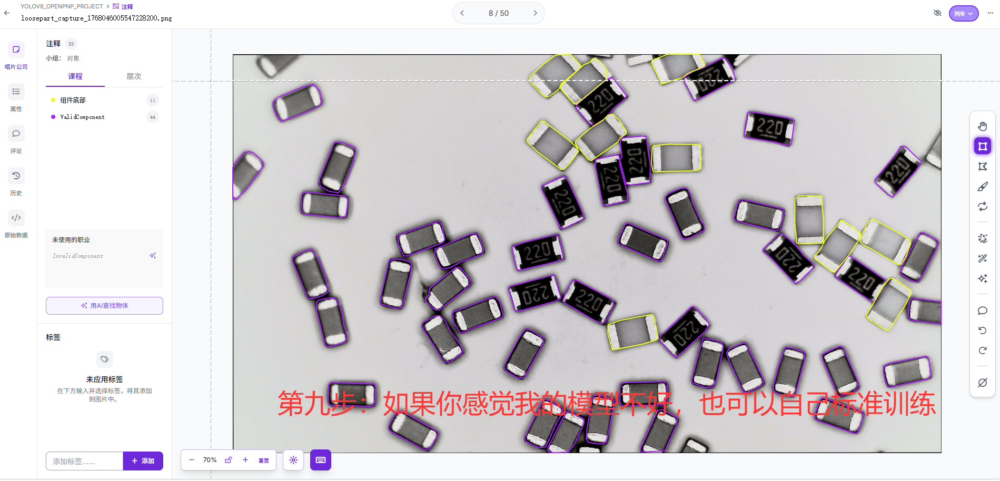

# OpenPnP YOLO 散料飞达

基于 YOLOv8 实例分割的散料飞达（`ReferenceLoosePartFeeder`）视觉识别方案，集成到 OpenPnP 标准飞达视觉管道中。

---

## 目录结构

```
openPNP_Script/
├── BulkFeederScript.js          # OpenPnP ScriptRun 入口（Rhino JavaScript）
├── yolo_inference.py            # YOLOv8 推理 + HTTP 常驻服务
├── best.pt                      # YOLO 模型权重（需自行放置，未纳入 git）
├── temp_images/                 # 图文教程截图（1.png–9.png）及临时调试图
├── requirements.txt             # Python 依赖
├── 散料飞达视觉通道配置.txt      # 飞达视觉管道 XML 模板
├── reset_yolo_service.py        # 终止残留 YOLO 服务进程（Windows）
├── cleanup_logs.py              # 清理日志与调试图像
├── SCRIPT_ENGINE_FIX.md         # 脚本引擎兼容性排障（.js / .bsh）
├── LICENSE                      # MIT 开源协议
└── README.md
```

---

## 架构概览

```
OpenPnP 飞达视觉管道
  ImageCapture → ConvertColor → ScriptRun (BulkFeederScript.js)
                                      │
                                      ├─ 健康检查 GET /health
                                      ├─ 若未运行则自动启动 yolo_inference.py --server
                                      └─ POST /infer（JPEG base64）
                                              │
                                              ▼
                                    yolo_inference.py（127.0.0.1:8765）
                                      YOLOv8 实例分割
                                      虚拟 MarkingPoint 计算
                                      图像坐标 → OpenPnP 坐标角度转换
                                              │
                                              ▼
                                    返回 RotatedRect 列表 → OpenPnP 取料定位
```

**设计要点：**

- YOLO 以 HTTP 常驻服务运行，避免每次取料都冷启动 Python 进程
- `BulkFeederScript.js` 自动检测服务状态，未运行时自动拉起
- 脚本路径通过 `stage.getFile()` 动态解析，默认回退到 `~/.openpnp2/openPNP_Script`
- 角度由 Python 端完成坐标系转换；OpenPnP 负责后续的 PCB 旋转补偿

---

## 图文快速上手

`temp_images/` 目录下 `1.png`–`9.png` 为完整配置流程截图，按编号依次操作即可。

### 第一步：复制脚本到 `.openpnp2`

将整个 `openPNP_Script` 文件夹复制到 OpenPnP 配置目录（Windows 默认 `C:\Users\<用户名>\.openpnp2\`）。



### 第二步：安装 Python 依赖

进入脚本目录，安装依赖。**推荐使用 Python 3.12**：

```bash
cd %USERPROFILE%\.openpnp2\openPNP_Script
pip install -r requirements.txt
# 或指定版本：pip3.12 install -r requirements.txt
```



### 第三步：复制视觉通道配置

打开 `散料飞达视觉通道配置.txt`，全选并复制其中的 `<cv-pipeline>...</cv-pipeline>` XML 内容到剪贴板，供下一步粘贴使用。



### 第四步：创建散料飞达

在 OpenPnP 中打开 **机器配置 → 飞达** 选项卡，点击 **+** 添加飞达，选择 **ReferenceLoosePartFeeder**，点击 **接受**。



### 第五步：编辑视觉通道

选中刚创建的飞达，点击 **Edit Pipeline**（编辑视觉通道）按钮。



### 第六步：从剪贴板粘贴配置

在视觉管道编辑窗口中，点击工具栏 **从剪贴板粘贴** 按钮，将第三步复制的管道配置导入。



### 第七步：设置脚本路径

在管道中找到 **ScriptRun** 阶段（`name="results"`），点击 `file` 字段旁的浏览按钮，选择本机 `BulkFeederScript.js` 的**绝对路径**。

默认参数 `yolo_confidence=0.25` 可按需调整。配置完成后可在预览窗口看到 YOLO 检测框。



### 第八步：模型训练（可选）

若需自行训练模型，在 [Roboflow](https://roboflow.com/) 打开项目：

- **项目 ID**：`yolov8_openpnp_project`

可使用 OpenPnP 飞达视觉产生的 `loosepart_capture_*.png` 调试图作为训练素材上传。



### 第九步：自行标注训练（可选）

若内置 `best.pt` 效果不理想，可在 Roboflow 中自行标注并训练。推荐标注类别：

| 类别 | 说明 |
|------|------|
| `ValidComponent` | 有效元件（推理脚本识别的目标类别） |
| `组件底座` | 元件底面 / 极性参考区域 |

训练完成后将导出的 `.pt` 模型替换脚本目录下的 `best.pt`。



---

## 补充配置

完成上述步骤后，还需注意以下事项。

### 放置模型文件

将 YOLOv8 实例分割模型放到脚本目录，默认文件名 `best.pt`。模型类别标签需包含 `ValidComponent`（见 `yolo_inference.py` 中 `COMPONENT_CLASS`）。

### 验证推理服务（可选）

```bash
# 手动启动服务
python yolo_inference.py --server 127.0.0.1 8765

# 健康检查
curl http://127.0.0.1:8765/health

# 命令行单次推理（调试用）
python yolo_inference.py best.pt test_image.png 0.25
```

> YOLO 服务通常由 `BulkFeederScript.js` 在首次取料时自动拉起，无需手动启动。

### 配置底部视觉（贴装校正）

飞达视觉负责取料定位，底部视觉负责贴装前角度校正，两者独立配置：

| 配置文件 | 作用 |
|----------|------|
| `../machine.xml` | 飞达位置、飞达视觉管道 |
| `../vision-settings.xml` | 底部视觉管道（`BottomVisionSettings`） |
| `../packages.xml` | 封装定义，通过 `bottom-vision-id` 关联底部视觉 |
| `../parts.xml` | 具体料号，关联 `package-id` |

**底部视觉关键参数（贴片电容等）：**

- `search-angle="180.0"` — 全角度搜索，避免接近 ±90° 时检测失败
- `asymmetric="true"` — 非对称元件
- 管道中包含 `OrientRotatedRects` 阶段处理角度方向

### 手动编辑 machine.xml（可选）

也可直接在 `machine.xml` 的 `ReferenceLoosePartFeeder` 中写入管道，模板见 `散料飞达视觉通道配置.txt`：

```xml
<cv-stage class="org.openpnp.vision.pipeline.stages.ScriptRun"
          name="results" enabled="true"
          file="C:\Users\17299\.openpnp2\openPNP_Script\BulkFeederScript.js"
          args="yolo_confidence=0.25"/>
```

> `name="results"` 必须输出 `RotatedRect` 列表，后续 `DrawRotatedRects` 阶段依赖此名称。

---

## 当前机器配置

| 项目 | 值 |
|------|-----|
| 启用飞达 ID | `FDR1888297a46b0441c` |
| 关联料号 | `C0603-100nF` |
| 脚本路径 | `openPNP_Script\BulkFeederScript.js` |
| YOLO 置信度 | `0.25` |
| 推理服务 | `http://127.0.0.1:8765` |
| 底部视觉 ID | `BVS18833a57dcb17178`（C0805/C0603 等共用） |

---

## BulkFeederScript.js 参数

通过 ScriptRun 的 `args` 传入，格式 `key1=value1,key2=value2`：

| 参数 | 默认值 | 说明 |
|------|--------|------|
| `yolo_model_path` | `{脚本目录}/best.pt` | YOLO 模型路径 |
| `yolo_confidence` | `0.25` | 置信度阈值 |
| `python_exe` | `python` | Python 可执行文件（不在 PATH 时需写完整路径） |
| `yolo_server_host` | `127.0.0.1` | 推理服务地址 |
| `yolo_server_port` | `8765` | 推理服务端口 |

示例：

```
yolo_confidence=0.3
yolo_model_path=C:\path\to\model.pt,yolo_confidence=0.3,python_exe=C:\Python311\python.exe
```

---

## YOLO 推理逻辑

`yolo_inference.py` 使用 YOLOv8 **实例分割**模型，除检测框外还计算虚拟极性标识点：

1. 从分割掩码提取元件几何（中心、尺寸、角度）
2. 在短边中点放置虚拟 MarkingPoint，用于极性方向判断
3. 接近垂直歧义（\|angle\| > 80°）时顺时针旋转 15° 重新判断
4. 角度规范化到 `[-180, 180)`，并完成图像坐标系（Y 轴向下）到 OpenPnP 坐标系（Y 轴向上）的转换

推理结果 JSON 字段：

```json
{
  "success": true,
  "detections": [
    {
      "center_x": 320.0,
      "center_y": 240.0,
      "width": 50.0,
      "height": 30.0,
      "angle": 45.0,
      "confidence": 0.92,
      "marker_center_x": 310.0,
      "marker_center_y": 235.0
    }
  ],
  "count": 1
}
```

HTTP API：

| 端点 | 方法 | 说明 |
|------|------|------|
| `/health` | GET | 服务健康检查 |
| `/infer` | POST | 推理，body 为 JSON（`model_path`、`image_base64`、`confidence_threshold`） |

---

## 辅助脚本

### 重置 YOLO 服务

OpenPnP 异常退出后，YOLO 服务可能残留在内存中：

```bash
python reset_yolo_service.py
```

查找并终止命令行含 `yolo_inference.py` 的进程，以及占用 TCP 8765 端口的进程。

### 清理日志

```bash
python cleanup_logs.py
```

清理 `BulkFeederScript.log`、`yolo_inference.log`、OpenPnP 调试图像目录等。

---

## 调试

### 日志文件

| 文件 | 来源 |
|------|------|
| `BulkFeederScript.log` | JS 脚本运行日志 |
| `yolo_inference.log` | Python 推理日志 |
| `../log/OpenPnP.log` | OpenPnP 主日志 |
| `../org.openpnp.vision.pipeline.stages.ImageWriteDebug/` | 视觉管道调试图像 |

飞达视觉调试图像前缀：`loosepart_capture_`、`loosepart_gray_`、`loosepart_script_`、`loosepart_result_`

底部视觉调试图像前缀：`bv_result_`

### 常见问题

| 现象 | 排查方向 |
|------|----------|
| `Unable to find scripting engine for BulkFeederScript.js` | 见 [SCRIPT_ENGINE_FIX.md](SCRIPT_ENGINE_FIX.md)，可尝试重命名为 `.bsh` |
| 检测不到元件 | 检查 `best.pt` 是否存在、置信度阈值、光照条件 |
| YOLO 服务启动失败 | 确认 `pip install ultralytics`、手动运行 `--server` 查看报错 |
| 取料角度偏差 | 检查 YOLO 日志中角度值；确认元件摆放方向与训练数据一致 |
| 贴装角度错误 | 检查底部视觉 `search-angle` 是否为 `180.0`；确认 `packages.xml` 中 `bottom-vision-id` 已关联 |
| 端口 8765 被占用 | 运行 `reset_yolo_service.py` 后重试 |

### 检查清单

- [ ] Python 依赖已安装（`ultralytics`、`opencv-python`、`numpy`）
- [ ] `best.pt` 模型文件存在
- [ ] `BulkFeederScript.js` 路径在 `machine.xml` 中正确（建议绝对路径）
- [ ] ScriptRun 阶段 `name="results"` 输出 `RotatedRect`
- [ ] 底部视觉 `search-angle="180.0"`（需要全角度搜索时）
- [ ] `packages.xml` / `parts.xml` 中 `bottom-vision-id` 已正确关联
- [ ] 调试图像阶段已启用，便于分析问题

---

## 为新元件添加散料飞达

1. 在 OpenPnP 中创建 Package 和 Part
2. 创建或复用底部视觉设置（`vision-settings.xml`），关联到 Package
3. 在 `machine.xml` 添加 `ReferenceLoosePartFeeder`，复制 `散料飞达视觉通道配置.txt` 中的管道
4. 设置 `part-id` 指向对应料号
5. 测试飞达 Feed → 检查调试图像和日志
6. 测试底部视觉 → 确认贴装角度正确

---

## 开源协议

本项目采用 [MIT License](LICENSE) 开源。

你可以自由使用、修改和分发本仓库中的脚本与文档，但需保留原始版权声明和许可全文。软件按「原样」提供，不提供任何明示或暗示的担保。

**第三方依赖**（各自遵循其开源协议）：

| 依赖 | 协议 | 说明 |
|------|------|------|
| [OpenPnP](https://openpnp.org/) | GPL-3.0 | 贴片机控制与视觉框架，本脚本作为其飞达视觉插件运行 |
| [Ultralytics YOLOv8](https://github.com/ultralytics/ultralytics) | AGPL-3.0 | 模型训练与推理 |
| OpenCV、NumPy | 各自许可证 | 图像处理与数值计算 |

> **说明**：`best.pt` 模型权重由用户自行训练或提供，不包含在本仓库的 MIT 许可范围内；分发模型时请遵守训练数据及 YOLO 框架的相关要求。

---

**最后更新**：2026-06-11（图文快速上手）  
**OpenPnP 版本**：2.0+  
**测试元件**：C0603 / C0805 贴片电容
